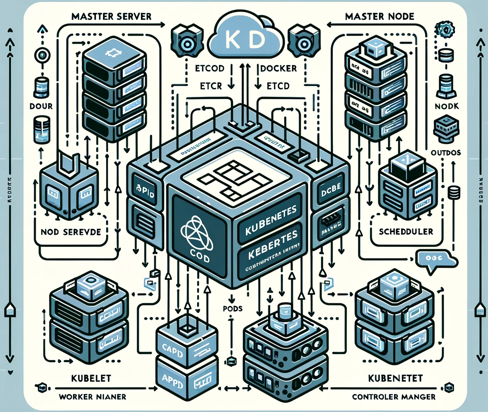
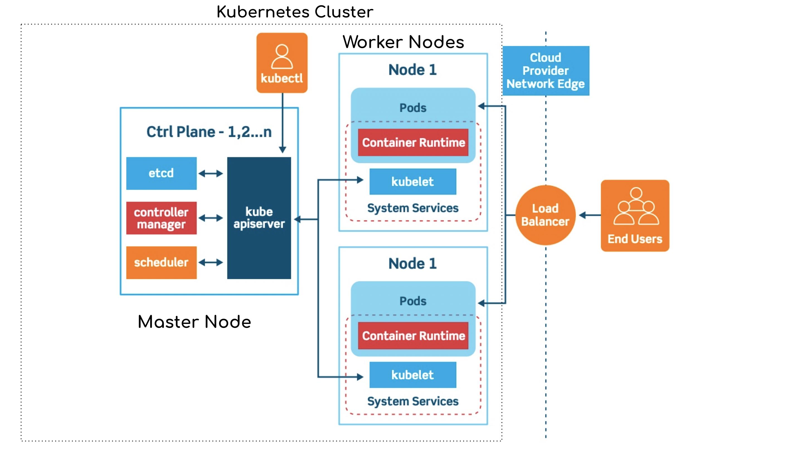

# Introducere si metodologie (1.1)

Prezentul studiu prezinta o propunere a abordare a strategiei de go-to-market pentru Neural Energy plecand de la o analiza in detaliu a principalelor probleme si solutii cu care se confrunta companiile si producatorii din industria software ce fie sunt specializati in zona Inteligentei Artificiale sau sunt consumatori de functionalitati si API-uri bazate pe invatare automata adanca (sau Deep Learning). 
Scopul studiului este atat intelegerea acestor probleme cat si identificarea oportunitatilor cu accent pe cele din zona implementarii, integrarii continue si mentinerii produselor bazate pe modele AI in medii avansate bazate pe procesore grafice (GPU).
In acest sens, studiul se concentreaza pe o analiza a oportunitatilor de inovare in domeniul AI si Deep Learning, cu accent pe eficienta energetica, scalabilitate si integrare continua respectand cele 6 componente conform contractului respectiv: (1.1) Metodologie, (1.2) Recenzii ale studiilor existente, (1.3) Analiza pietei potentiale, (1.4) Analiza tendintelor, (1.5) Propuneri strategice pentru abordarea piete, (1.6) Analiza concurentei. I
> Datorita modului in care a fost realizata cercetarea si abordarii iterative a subiectului, unele dintre aceste componente se suprapun si se regasesc in mai multe sectiuni ale studiului. Totodata acestea sunt prezentate in ordinea in care au fost abordate si nu in ordinea in care au fost enumerate in contractul de cercetare. Cu toate acestea au fost inserate referinte clare la punctele cerute in contractul de cercetare.

 

 Imagine simbolica obtinuta cu model neural generativ  

Dezvoltatorii de aplicații software bazate pe AI, și în special pe Deep Learning, se confruntă cu o serie de provocări semnificative, care pot include:

1. **Complexitatea Modelului și Resursele Necesare**: Modelele de Deep Learning pot fi extrem de complexe și necesită o cantitate mare de date pentru antrenare. Aceasta presupune necesitatea unor resurse computaționale însemnate (de exemplu, GPU-uri puternice), ceea ce poate crește semnificativ costurile.

2. **Calitatea și Cantitatea Datelor**: Accesul la date de înaltă calitate și în cantități mari este esențial. Adesea, datele pot fi neorganizate, necurate sau insuficiente pentru a antrena modele eficiente.

3. **Overfitting și Generalizare**: Există riscul ca modelele să se adapteze prea bine la datele de antrenament (overfitting), ceea ce le reduce capacitatea de a performa bine pe date noi, nevăzute.

4. **Explicabilitate și Transparență**: Modelele de Deep Learning sunt adesea considerate „cutii negre”, deoarece modul în care ajung la o anumită predicție nu este întotdeauna clar. Acest lucru poate fi problematic în domenii unde explicabilitatea și transparența sunt cruciale.

5. **Securitate și Vulnerabilități**: Modelele de AI sunt susceptibile la diverse atacuri, cum ar fi atacurile adversariale, care pot manipula rezultatele modelului.

6. **Conformitate și Etică**: Există preocupări legate de confidențialitatea datelor, bias în AI și conformitatea cu reglementările legale (de exemplu, GDPR).

7. **Integrarea în Sistemele Existente**: Integrarea soluțiilor de AI în infrastructura IT existentă și asigurarea compatibilității cu alte sisteme poate fi dificilă.

8. **Scalabilitatea**: Asigurarea că modelele pot fi scalate eficient pentru a gestiona volume mari de date sau pentru a fi implementate în diferite medii poate reprezenta o provocare.

9. **Talent și Expertiză**: Există o penurie de talente cu expertiză profundă în AI și Deep Learning, ceea ce poate îngreuna dezvoltarea și menținerea aplicațiilor avansate.

Aceste probleme sunt reflectate în cercetări, dezvoltări de produs și strategii de afaceri din industria AI și sunt subiecte constante de inovare și îmbunătățire.

# O privire asupra stadiului actual al tehnologiei (1.2)

Analizând din perspectiva resurselor necesare, scalabilității, implementării și integrării continue, principalele probleme cu care se confruntă dezvoltatorii de software bazat pe AI și Deep Learning sunt complexe și multifacete. Acestea variază de la nevoia de a gestiona resurse computaționale considerabile, la provocările privind adaptarea și integrarea tehnologiilor în sisteme existente, până la asigurarea unei scalabilități eficiente. În cele ce urmează, voi detalia aceste aspecte.

## Principalele componente critice

### Resursele Necesare

Dezvoltarea și implementarea aplicațiilor de AI și Deep Learning presupun accesul la resurse computaționale avansate. Modelele de Deep Learning, în special, sunt resurse-intensive, necesitând cantități mari de date pentru antrenare și o capacitate de procesare substanțială.

1. **Hardware**: AI și Deep Learning necesită hardware specializat, cum ar fi unități de procesare grafică (GPU) sau unități de procesare a tensorilor (TPU) pentru a gestiona eficient calculul paralel necesar. Costul acestui hardware poate fi prohibitiv pentru startup-uri sau companii mici.

2. **Stocarea Datelor**: Datelor mari necesită soluții de stocare scalabile și eficiente din punct de vedere al costurilor. Cloud computing-ul oferă flexibilitate, dar costurile pot crește rapid în funcție de volumul de date și cerințele de acces.

3. **Energie**: Consumul mare de energie este o altă preocupare, în special în contextul creșterii conștientizării impactului ecologic al tehnologiei.

### Scalabilitate

Scalabilitatea în AI și Deep Learning implică capacitatea de a extinde modelele și infrastructura pentru a gestiona volume crescute de date și cereri de procesare, menținând în același timp performanța și eficiența.

1. **Scalarea Verticală versus Orizontală**: Scalarea verticală (adăugarea de mai multă putere de procesare la un singur nod) are limitele sale. Scalarea orizontală (adăugarea de mai multe noduri) este mai flexibilă, dar prezintă provocări legate de coordonarea și sincronizarea între noduri.

2. **Echilibrarea Încărcării**: Asigurarea unei distribuții eficiente a sarcinilor de lucru este crucială pentru menținerea performanței pe măsură ce sistemul se extinde.

3. **Optimizarea Modelului**: Modelele de Deep Learning trebuie optimizate pentru a asigura că pot fi scalate eficient, fără a compromite acuratețea sau timpul de răspuns.

### Implementare

Implementarea aplicațiilor AI în medii de producție reale necesită o planificare atentă și gestionarea unor provocări unice.

1. **Dependența de Mediu**: Aplicațiile AI trebuie să funcționeze în diverse medii, care pot varia în termeni de hardware, sisteme de operare și alte software-uri.

2. **Actualizările Modelului**: Implementarea unor metode eficiente pentru actualizarea și menținerea modelelor este esențială. Modelele trebuie actualizate frecvent pentru a reflecta noi date și învățări.

3. **Monitorizare și Depanare**: Monitorizarea performanței și identificarea rapidă a problemelor sunt esențiale pentru menținerea calității serviciului.

### Integrare Continuă

Integrarea continuă în dezvoltarea software-ului AI presupune integrarea automată și frecventă a modificărilor de cod într-un depozit comun, urmată de testare automatizată.

1. **Automatizarea Testării**: Crearea de teste automate care pot valida eficient funcționalitatea și performanța modelelor AI este complexă, dar vitală.

2. **Compatibilitatea cu Sistemele Existente**: Integrarea noilor tehnologii AI cu sistemele și procesele existente poate fi dificilă, necesitând adesea adaptări

## Focusul in eficienta energetica, scalabilitate si integrare continua

Abordând problema consumului masiv de energie necesar pentru antrenarea și inferența modelelor de AI, în special a celor de tip Large Language Model (LLM), precum și provocările legate de orchestrarea proceselor de serviciu, automatizarea scalării și integrării, există multiple oportunități în această zonă, atât din perspectiva cercetării tehnologice, cât și din cea a comercializării.

### Eficientizarea Consumului de Energie

1. **Cercetarea în Eficientizarea Hardware-ului**: Dezvoltarea de hardware mai eficient din punct de vedere energetic pentru AI este un domeniu promițător. Noile arhitecturi de cipuri, optimizate pentru calculele AI, pot reduce semnificativ consumul de energie.

2. **Algoritmi mai Eficienți**: Cercetarea se concentrează pe dezvoltarea de algoritmi care necesită mai puțină putere de procesare. Acest lucru include optimizarea modelelor existente și crearea de noi modele care sunt intrinsec mai eficiente.

3. **Utilizarea Energiei Regenerabile**: Folosirea energiei regenerabile în centrele de date poate reduce amprenta de carbon a antrenării și rulării modelelor AI.

### Automatizarea și Scalarea

1. **Orchestrare și Automatizare**: Oportunități majore există în dezvoltarea unor soluții mai avansate de orchestrare și automatizare care să faciliteze gestionarea eficientă a resurselor și scalarea aplicațiilor.

2. **Microservicii și Containere**: Utilizarea arhitecturii bazate pe microservicii și containerizare poate ajuta la o scalare mai eficientă și la o mai bună gestionare a resurselor.

3. **Platforme de AI ca Serviciu (AIaaS)**: Crearea de platforme care oferă AI ca serviciu poate reduce barierele de intrare pentru companii mici și mijlocii, oferind acces la resurse de calcul scalabile fără investiții inițiale masive.

### Comercializarea Tehnologiilor

1. **Servicii Cloud pentru AI**: Există o cerere mare pentru furnizarea de infrastructuri cloud optimizate pentru AI. Companiile pot oferi soluții care să minimizeze consumul de energie și să optimizeze performanța.

2. **Consultanță și Integrare**: Oportunități de afaceri apar în oferirea de servicii de consultanță și integrare pentru companiile care doresc să implementeze AI, dar care se confruntă cu provocări tehnice sau de resurse.

3. **Educație și Training**: Există o cerere crescândă pentru educație și training în domeniul AI, nu doar pentru dezvoltatori, ci și pentru manageri și decidenți care doresc să înțeleagă mai bine potențialul și limitările tehnologiei.

### Cercetare și Dezvoltare

1. **Cercetare în AI Verde**: Investițiile în cercetarea AI-ului mai eficient din punct de vedere energetic pot duce la inovații semnificative, reducând impactul ecologic.

2. **Parteneriate Academice-Industriale**: Colaborările între universități și companii pot accelera dezvoltarea de noi tehnologii și soluții în domeniul AI.

3. **Finanțarea Cercetării**: Guvernele și organizațiile private pot juca un rol crucial în finanțarea cercetării în domeniul eficientizării AI.

### Responsabilitatea Socială Corporativă

1. **Sustenabilitate și Etică**: Companiile care dezvoltă și comercializează AI pot adopta politici de responsabilitate socială corporativă, concentrându-se pe reducerea impactului ecologic și asigurarea folosirii etice a AI.

2. **Transparență și Conștientizare**: Educația publicului și transparența cu privire la utilizarea AI și impactul său ec

ologic sunt esențiale pentru a construi încredere și pentru a promova utilizarea responsabilă a tehnologiei.

În concluzie, provocările legate de consumul de energie și gestionarea resurselor în AI oferă oportunități ample pentru inovare în cercetare, dezvoltare și comercializare. Prin abordarea acestor probleme, industria poate nu doar să îmbunătățească eficiența și scalabilitatea soluțiilor de AI, dar și să contribuie la un viitor mai sustenabil și responsabil din punct de vedere ecologic.

# Recenzia studiilor si abordarilor exitente (1.2)

Proiectul "Neural Energy", reprezentat inclusiv pe GitHub, cu subbiblioteca sa "basic_inference_server", se încadrează în mai multe dintre oportunitățile discutate anterior în ceea ce privește eficiența energetică, automatizarea, scalarea și integrarea în domeniul AI și Deep Learning.

## Solutii existente vs Neural Energy

Biblioteca adoptă o arhitectură bazată pe microservicii, orchestrată sub un gateway distribuit. Acest paradigmă de design nu doar facilitează procesarea multi-worker, ci și generează un mediu robust pentru găzduirea diverselor microservicii. Fiecare microserviciu este identificat distinct printr-o proprietate cunoscută sub numele de „SEMNEAZĂ”, care acționează ca un element central în rutarea cererilor către serviciul respectiv. Depozitul principal este echipat cu un mecanism de autobuild declanșat de o operație de push, urmată de o simplă comandă pentru a reporni și actualiza containerul Docker pe server, asigurând astfel că cea mai recentă versiune a serviciului este întotdeauna implementată.

Biblioteca Basic Inference Server facilitează orchestrarea containerelor docker printr-un script simplist care rulează pe server, asigurând continuu că containerul Docker este activ și funcțional. Persistența datelor între sesiuni este asigurată prin gestionarea volumului, menținând datele intacte și disponibile pe parcursul diferitelor sesiuni.

Dezvoltatorii vor găsi avantajoasă prevederea pentru instrucțiuni locale și la distanță de construire și rulare a dockerului, permițând un mediu de dezvoltare și testare flexibil. Biblioteca este proiectată cu o atenție meticuloasă pentru detalii; de exemplu, pregătirea mediului este articulată bine pentru acomodarea incorporărilor neuronale de cuvinte în stratul de mediu.

La baza sa, motorul funcționează ca un gateway de microservicii, fiecare server rulând lucrători paraleli pentru a gestiona cererile primite. O caracteristică unică este capacitatea de a interoga lista serverelor active, care oferă o perspectivă asupra microserviciilor disponibile în prezent. Mai mult, biblioteca oferă o abordare sistematică pentru a reporni sau actualiza toate serverele din containerul automatizat, asigurând astfel robustețea sistemului.

Utilitatea bibliotecii nu se oprește doar la găzduirea microserviciilor; se extinde la interogarea unui microserviciu cu o API bine definită. API-ul este proiectat meticulos pentru a găzdui o varietate de puncte finale, fiecare cu un set unic de cerințe. Acest lucru se manifestă în modul în care câmpul SEMNEAZĂ este folosit pentru a identifica microserviciul, în timp ce alte câmpuri sunt personalizate pentru nevoile specifice ale punctului final.

Mai mult, biblioteca oferă o expunere detaliată despre cum să configurezi Docker pe un VM Azure, lărgind astfel orizontul pentru implementare în medii cloud. Acest lucru, împreună cu definițiile API-ului bine articulate pentru diverse caracteristici utilitare, cum ar fi starea de sănătate a sistemului, oferă un pachet complet pentru gestionarea și interogarea microserviciilor implementate.

Biblioteca strălucește și în prevederea sa pentru informații API programatice, demonstrând o cale clară pentru configurarea serverelor dummy și ilustrând configurația necesară pentru configurarea diverselor puncte finale. Fragmentele de cod furnizate elucidează arhitectura lucrătorilor, modelelor și punctelor finale, oferind o hartă clară pentru dezvoltatori pentru a integra modelele lor și a le implementa.

### Eficientizarea Consumului de Energie

Deși documentația proiectului online "Neural Energy" nu specifică direct abordări pentru eficientizarea consumului de energie, conceptul unui server de inferență bazat pe microservicii sugerează o arhitectură care poate fi optimizată pentru eficiență energetică. Utilizarea microserviciilor permite distribuirea sarcinilor de procesare, potențial reducând consumul de resurse prin escaladarea orizontală și prin folosirea eficientă a hardware-ului. Analizand in ansamblu proiectul dincolo de elementele software publicate constantam propunerea si demonstrarea concreta a unei infrastructuri de tip unitate-mobila-independenta. Prin aceasta abordare se doreste utilizarea in-situ a resurselor de calcul cu ajutorul unor unitati mobile independente de resursele de calcul locale alimentate prin intermediul energiei solare. Aceasta abordare este in concordanta cu tendintele actuale de dezvoltare a sistemelor de tip edge computing.

### Automatizarea și Scalarea

Aspectele de CI/CD (Continuous Integration/Continuous Deployment) menționate în documentația proiectului indică o abordare automatizată și scalabilă. Automatizarea construcției și actualizărilor (cum ar fi prin utilizarea Docker) facilitează gestionarea eficientă a resurselor și scalarea aplicațiilor.

Analiza propunerii Neural Energy pentru `.devcontainer` și `Dockerfile` indică o abordare structurată și eficientă pentru crearea unui mediu de dezvoltare pentru software-ul lor. Voi analiza fiecare componentă în parte pentru a oferi o înțelegere mai clară a configurației și a intențiilor din spatele acesteia.

__**.devcontainer & Docker**__

Fisierul `.devcontainer` este utilizat pentru a configura un mediu de dezvoltare în container pentru Visual Studio Code. Acesta definește setările și extensiile necesare pentru a oferi un mediu de dezvoltare consistent și eficient.

- **"name"**: Eticheta containerului este descriptivă și clară, ajutând la identificarea sa în cadrul unui proiect mai amplu.
- **"dockerFile"**: Indică utilizarea unui Dockerfile specific pentru a construi imaginea containerului.
- **"runArgs"**: Argumentele de rulare configurează containerul pentru a utiliza un fișier de mediu (`.env`), îi atribuie un nume specific și mapează un interval de porturi, ceea ce este util pentru testarea și accesarea serviciilor găzduite în container.
- **"customizations"**: 
  - "vscode": 
    - "settings": Specifică o setare personalizată `bumpTag` care ar putea fi utilizată pentru a urmări versiunile sau configurațiile.
    - "extensions": Lista extensiilor VSCode sugerează o încărcare puternică pe dezvoltarea Python, integrarea cu GitHub, Docker și Jupyter, ceea ce este consistent cu un mediu de dezvoltare axat pe AI și machine learning.

Dockerfile-ul furnizează instrucțiuni pentru construirea imaginii Docker a mediului de dezvoltare.

- **FROM**: Folosește o imagine de bază personalizată `aidamian/base_llm_env:latest`, probabil optimizată pentru medii de dezvoltare AI și machine learning.
- **WORKDIR**: Setează directorul de lucru în container.
- **ENV**: Variabilele de mediu sunt setate pentru a configura comportamentul aplicației.
  - `TZ` setează fusul orar, ceea ce este util pentru logging și programare.
  - `AID_APP_*` sunt variabile specifice aplicației, care configurează cum se comportă aplicația în diferite medii (de exemplu, forțarea rulării pe CPU, activarea modului debug).
  - `NEAIL_VERSION` indică versiunea aplicației, esențială pentru urmărirea versiunilor și depistarea problemelor.
- **EXPOSE**: Expune un interval de porturi, semnalând porturile care vor fi utilizate de aplicație.

Configurația `.devcontainer` și `Dockerfile` sugerează o concentrare puternică pe crearea unui mediu de dezvoltare robust și bine definit pentru proiecte de AI și machine learning. Utilizarea unui mediu de containerizare asigură consistența și reproductibilitatea, fiind esențiale în dezvoltarea software-ului modern, în special în domenii avansate cum ar fi AI. Adăugarea unui set bogat de extensii și unor configurări personalizate reflectă o abordare detaliată și bine gândită, menită să faciliteze procesul de dezvoltare și să îmbunătățească eficiența.

### Comercializarea Tehnologiilor

Natura Neural Energy de platforma deschisa și focusul pe un server de inferență bazat pe microservicii sugerează potențial pentru comercializare în nișe care necesită implementări de AI flexibile și scalabile.

### Cercetare și Dezvoltare

Documentația proiectului detaliază diferite etape ale dezvoltării, indicând un proces de cercetare și dezvoltare în curs. Acesta include dezvoltarea unui MVP (Minimum Viable Product), integrarea submodulelor și îmbunătățirea continuă a prototipului. Acest lucru este în concordanță cu tendințele actuale în cercetarea AI de a dezvolta soluții mai eficiente și scalabile.

### Responsabilitatea Socială Corporativă

Nu există informații specifice în documentație despre aspectele de responsabilitate socială corporativă. Cu toate acestea, faptul că proiectul este partial open-source poate sugera un angajament față de transparență și colaborare în comunitatea de dezvoltatori.

## Oportunități de inovare

Proiectul "Neural Energy" și subbiblioteca sa "basic_inference_server" se aliniază la multe dintre oportunitățile identificate în domeniul AI și Deep Learning. Accentul pe automatizare, scalabilitate și utilizarea arhitecturilor bazate pe microservicii sugerează un potențial semnificativ pentru inovație și eficiență în acest domeniu. Cu toate acestea, pentru a obține o imagine completă și detaliată a proiectului și a oportunităților sale, ar fi util să se urmărească evoluția și dezvoltarea acestuia pe GitHub și alte platforme relevante.

Proiectul "Neural Energy", cu focusul său pe un server de inferență bazat pe microservicii, se adresează unei game largi de potențiali destinatari în diverse domenii care necesită integrarea AI și Deep Learning. Voi detalia mai jos potențialii destinatari și tipurile de proiecte sau produse pentru care acest proiect ar putea fi relevant.
Analizând proiectul "Neural Energy" și subbiblioteca sa "basic_inference_server", putem identifica mai mulți potențiali destinatari și domenii de aplicare pentru acest tip de proiect. Acestea pot fi grupate în funcție de diverse criterii, cum ar fi dimensiunea și tipul organizației, necesitățile specifice legate de AI și contextul de utilizare.

### Prototiparea mediului dincolo de unitatea mobila

Proiectul "Neural Energy" și subbiblioteca sa "basic_inference_server" se aliniază la multe dintre oportunitățile identificate în domeniul AI și Deep Learning asa cum deja a fost observat. Notabil este faptul ca desi scopul infrastructurii software este de a fi rulate in cadrul unitatii mobile, a fost proiectata si executata o abordare si o integrare completa cu Google Cloud Platform. Aceasta abordare este in concordanta cu tendintele actuale de orchestrare a microserviciilor AI si demonstreaza flexibilitatea componentelor software propuse.

Analiza fișierului `cloudbuild.yaml` specific pentru Google Cloud Platform (GCP) dezvăluie o serie de pași structurați pentru automatizarea procesului de dezvoltare și implementare a unei aplicații. Fiecare pas reflectă un aspect crucial al pipeline-ului de CI/CD (Continuous Integration/Continuous Deployment).

#### Pasul 1: Clonarea Repositoriului

- **Utilitate**: Asigură că cea mai recentă versiune a codului sursă, inclusiv submodulele, este accesibilă în mediul de build.
- **Oportunitate**: Simplifică gestionarea codului sursă și menține coerența între diferitele medii de dezvoltare și producție.

#### Pasul 2: Construirea Imaginii Docker

- **Utilitate**: Creează o imagine Docker pentru aplicație, asigurând o platformă de rulare consistentă și izolată.
- **Oportunitate**: Permite testarea și desfășurarea rapidă a aplicației în diferite medii, reducând problemele legate de „funcționează pe calculatorul meu”.

#### Pasul 3: Încărcarea Imaginii în Google Container Registry

- **Utilitate**: Încărcarea imaginii în Google Container Registry (GCR) facilitează accesul și distribuirea imaginii Docker în cadrul infrastructurii cloud.
- **Oportunitate**: Oferă un mecanism eficient și securizat pentru stocarea și distribuirea imaginilor containerelor în cadrul proiectelor GCP.

#### Pasul 4: Implementarea pe Cloud Run

- **Utilitate**: Automatizează procesul de implementare a aplicației în serviciul Cloud Run al GCP.
- **Configurații Specifice**: 
    - **Setări de Mediu**: Asigură transmiterea variabilelor de mediu necesare aplicației.
    - **Acces Non-autentificat**: Facilitează accesul public la aplicație.
    - **Configurarea Resurselor**: Stabilește limitele de memorie și CPU, și controlează scalarea serviciului.
    - **Minim și Maxim de Instanțe**: Permite controlul asupra numărului de instanțe care rulează, optimizând costurile și performanța.

- **Oportunitate**: Facilitează implementarea rapidă și eficientă, permite scalarea și adaptarea resurselor în funcție de cerințe, și reduce timpul necesar pentru desfășurarea de noi versiuni sau actualizări.

#### Configurații Generale

- **Imagini Docker Definite**: Specifică imaginile care trebuie construite și încărcate în GCR, asigurând coerența între construcție și desfășurare.

#### Concluzie

Configurația `cloudbuild.yaml` reflectă o abordare strategică și bine structurată pentru automatizarea și optimizarea procesului de CI/CD în cadrul GCP. Utilizarea serviciilor cloud native, cum ar fi Cloud Build, Container Registry și Cloud Run, oferă avantaje semnificative în termeni de eficiență, scalabilitate și securitate. Aceasta permite echipei de dezvoltare să se concentreze mai mult pe inovare și dezvoltare, în timp ce infrastructura și procesele de desfășurare sunt gestionate în mod eficient și automatizat.

## Analiza potențialilor clienti (1.3)

In cele ce urmeaza vom analiza potentialii clienti ai proiectului "Neural Energy", subbiblioteca sa "basic_inference_server" impreuna cu intreaga infrastructura fizica a unitatii mobile, in functie de dimensiunea si tipul organizației, necesitățile specifice legate de AI și contextul de utilizare.

### Companii și Organizații Tehnologice

1. **Start-up-uri de Tehnologie**: Start-up-urile care dezvoltă soluții bazate pe AI și au nevoie de o infrastructură scalabilă și eficientă ar putea beneficia de pe urma acestui proiect. Fiind adesea limitate de resurse, aceste companii ar putea utiliza "Neural Energy" pentru a accelera dezvoltarea și implementarea modelelor de AI.

2. **Companii Mijlocii și Mari**: Companiile mai mari, care au deja sisteme IT complexe, pot folosi "Neural Energy" pentru a integra soluții de AI în operațiunile existente, profitând de avantajele arhitecturii bazate pe microservicii pentru a gestiona sarcini AI complexe.

Companiile de tehnologie, în special startup-urile inovatoare, pot beneficia de pe urma flexibilității și scalabilității oferite de arhitectura bazată pe microservicii a proiectului "Neural Energy". Această abordare le permite să dezvolte și să implementeze rapid soluții AI personalizate, adaptându-se nevoilor în schimbare ale pieței.

**Proiecte relevante**:
- Sisteme de recomandare: Utilizarea AI pentru a oferi recomandări personalizate utilizatorilor în e-commerce, streaming media sau alte servicii online.
- Procesare de limbaj natural (NLP): Dezvoltarea de chatboți, asistenți virtuali, sau sisteme de analiză a sentimentelor.
- Viziune computerizată: Aplicații pentru recunoașterea imaginilor, analiza video sau sisteme de supraveghere inteligente.

### Domenii Specifice

1. **Sănătate**: În domeniul sănătății, unde analiza datelor și predicțiile bazate pe AI pot juca un rol crucial în diagnosticare și cercetare, "Neural Energy" ar putea oferi infrastructura necesară pentru gestionarea eficientă a datelor medicale și realizarea de inferențe precise.
Instituțiile de sănătate pot beneficia de AI pentru a îmbunătăți diagnosticarea, tratamentul și monitorizarea pacienților. "Neural Energy" ar putea facilita dezvoltarea de soluții de analiză a datelor medicale, contribuind astfel la îmbunătățirea rezultatelor pentru pacienți.

**Proiecte relevante**:
- Diagnosticare asistată de AI: Utilizarea algoritmilor de învățare automată pentru a analiza imagini medicale și a ajuta la diagnosticarea bolilor.
- Monitorizare și predicție: Sisteme de monitorizare a pacienților care utilizează AI pentru a prezice și preveni complicațiile.
- Managementul datelor medicale: Analiza datelor pacienților pentru a îmbunătăți eficiența administrativă și calitatea îngrijirilor.

2. **Finanțe**: Sectorul financiar, care se bazează tot mai mult pe AI pentru analiza de piață, detectarea fraudelor și personalizarea serviciilor, ar putea utiliza "Neural Energy" pentru a gestiona sarcinile de procesare intensivă necesare pentru aceste activități. Bănci, companii de asigurări și alte entități din sectorul financiar pot utiliza "Neural Energy" pentru a îmbunătăți eficiența și acuratețea serviciilor lor. AI și analiza de date pot juca un rol crucial în detectarea fraudelor, managementul riscului și personalizarea ofertelor pentru clienți.

**Proiecte relevante**:
- Detectarea fraudelor: Utilizarea algoritmilor de învățare automată pentru a identifica tranzacții suspecte sau activități neobișnuite.
- Managementul riscului: Analiza de date complexe pentru a evalua riscul de credit sau piață.
- Personalizare: Crearea de modele care să personalizeze experiența clienților în funcție de comportamentul și preferințele lor.

3. **Retail și eCommerce**: În retail, AI este folosit pentru a îmbunătăți experiența clienților și pentru a optimiza lanțurile de aprovizionare. "Neural Energy" ar putea oferi o soluție eficientă pentru gestionarea recomandărilor personalizate și analiza comportamentului consumatorilor.

### În Contextul Educațional și de Cercetare

1. **Universități și Institutii de Cercetare**: Aceste instituții ar putea folosi "Neural Energy" pentru proiecte de cercetare în AI, beneficiind de pe urma arhitecturii sale flexibile și scalabile pentru experimente complexe.

2. **Proiecte de Educație**: Proiectele educaționale care se concentrează pe AI și machine learning ar putea folosi "Neural Energy" ca platformă de învățare și demonstrație pentru studenți și cercetători. Școli, universități și alte instituții educaționale pot folosi "Neural Energy" pentru a dezvolta soluții educaționale personalizate, îmbunătățind astfel experiența de învățare și rezultatele educaționale.

**Proiecte relevante**:
- Platforme de învățare personalizate: Dezvoltarea de sisteme care adaptează materialele educaționale la nevoile și stilurile individuale de învățare ale studenților.
- Analiza comportamentului de învățare: Folosirea datelor pentru a înțelege mai bine modul în care studenții interacționează cu materialele educaționale și pentru a îmbunătăți programele de studiu.

### În Industria Serviciilor și Consultanței

1. **Furnizori de Servicii Cloud și IT**: Aceste companii ar putea oferi "Neural Energy" ca parte a portofoliului lor de servicii, oferind clienților soluții AI personalizate și eficiente.

2. **Consultanți în Tehnologie și AI**: Consultanții pot folosi "Neural Energy" pentru a ajuta companiile să integreze AI în operațiunile lor, oferind expertiză în configurarea și utilizarea platformei.

### În Industrii Specifice

1. **Automatizare Industrială și IoT**: În domeniul IoT și automatizare, "Neural Energy" ar putea fi folosit pentru a gestiona și procesa datele generate de dispozitivele conectate, oferind soluții de AI pentru automatizarea proceselor.

2. **Auto și Transporturi**: În industria auto, unde AI este utilizat pentru dezvoltarea vehiculelor autonome și optimizarea logisticii, "Neural Energy" ar putea oferi infrastructura necesară pentru procesarea și analiza datelor.

# Competitie 

## Analiza generala a competitiei si a tendintelor (1.4)

Analizând piața actuală a serverelor de inferență AI, putem identifica o serie de soluții existente care ar putea fi considerate competitori pentru produsul Neural Energy. Acești competitori variază de la soluții complexe la cele mai simple și provin de la o varietate de producători și companii.

### Producătorii Majori și Soluțiile lor

La o analiza generala a pietei actuale a serverelor de inferenta AI, putem identifica o serie de solutii existente care ar putea fi considerate competitori pentru produsul Neural Energy. Acești competitori variază de la soluții complexe la cele mai simple și provin de la o varietate de producători și companii. Cei mai importanți producători de servere AI sunt NVIDIA, Intel, Inspur Systems, Dell, Hewlett Packard Enterprise (HPE), Lenovo, Huawei, IBM, Giga Byte, H3C și Super Micro Computer. Aceste companii oferă o gamă largă de soluții de servere AI, care variază în funcție de performanță, eficiență energetică, scalabilitate și integrare cu alte tehnologii. Implicit, analizand abordarea si oferta acestora ipoteza competitiei cu Neural Energy este invalidata datorita faptului ca aceste solutii sunt de tip bare-hardware sau hardware-as-a-service. 

1. **NVIDIA**: NVIDIA este unul dintre liderii de piață în domeniul serverelor de inferență AI. Soluțiile lor sunt recunoscute pentru performanțele ridicate și sunt utilizate pe scară largă în multe industrii. Produsele NVIDIA sunt cunoscute pentru eficiența lor energetică și puterea de procesare.

2. **Intel**: Intel oferă, de asemenea, o gamă de servere de inferență AI, care se concentrează pe eficiență și scalabilitate. Intel este renumit pentru soluțiile sale care combină hardware și software pentru a oferi performanțe optimizate.

3. **Inspur Systems**: Inspur oferă soluții de servere de inferență AI personalizabile, care pot fi adaptate la cerințele specifice ale clienților. Sunt cunoscute pentru flexibilitatea și adaptabilitatea lor.

4. **Dell**: Dell este un alt jucător important pe piața serverelor de inferență AI. Produsele lor sunt proiectate pentru a fi robuste și fiabile, potrivite pentru utilizare într-o varietate de medii de afaceri.

5. **Hewlett Packard Enterprise (HPE)**: HPE oferă soluții care se concentrează pe integrarea cu ecosistemele de cloud și pe furnizarea de servicii scalabile pentru companii.

6. **Lenovo**: Lenovo produce servere de inferență AI care sunt apreciate pentru fiabilitatea și performanța lor, fiind bine adaptate pentru medii de afaceri și cercetare.

7. **Huawei**: Huawei este un producător care oferă servere de inferență AI cu tehnologii avansate, focalizându-se pe inovație și eficiență energetică.

8. **IBM**: IBM oferă soluții de servere AI care sunt cunoscute pentru capabilitățile lor avansate de analiză și procesare a datelor.

9. **Giga Byte**, **H3C** și **Super Micro Computer**: Aceste companii oferă, de asemenea, servere de inferență AI și sunt recunoscute pentru soluțiile lor personalizabile și eficiente.

### Concurența pe Piață serverelor (1.6)

Pe piața serverelor de inferență AI, concurența este intensă, iar companiile se concentrează pe inovare și eficiență pentru a se diferenția. Soluțiile variază în ceea ce privește capacitatea de procesare, eficiența energetică, scalabilitatea și integrarea cu alte tehnologii. Companiile mari, cum ar fi NVIDIA și Intel, au o prezență puternică pe piață datorită reputației lor în domeniul tehnologic și a investițiilor semnificative în cercetare și dezvoltare.

### Implicații pentru Neural Energy

Pentru Neural Energy, această piață competitivă reprezintă atât o provocare, cât și o oportunitate. Provocarea constă în a se diferenția de soluțiile existente, care sunt oferite de companii cu resurse considerabile și un istoric puternic în domeniu. Oportunitatea vine din posibilitatea de a inova și de a oferi soluții care răspund nevoilor specifice ale clienților sau care aduc îmbunătățiri în domenii precum eficiența energetică, costul sau flexibilitatea. In acest context, Neural Energy se adreseaza unei nise de piata care nu este acoperita de aceste solutii. Mai mult de atat, solutia de unitate-mobila-independenta propusa de Neural Energy impreuna cu infrastructura software de tip microservicii este o solutie complementara acestor solutii de tip bare-hardware sau hardware-as-a-service.

## Analiza concurentei (1.6)

In continuare vom prezenta principalii competitori ai solutiei software propuse de Neural Energy.

### standardul de facto pentru orchestarea containerelor

Kubernetes este o platformă open-source pentru orchestrarea containerelor. Acesta automatizează procesele de implementare, scalare și gestionare a aplicațiilor în containere. Kubernetes a fost dezvoltat de Google și este acum gestionat de Cloud Native Computing Foundation. Kubernetes este o soluție populară pentru gestionarea aplicațiilor containerizate, fiind utilizată de companii precum Google, Microsoft, IBM, Cisco, Huawei și multe altele.
Kubernetes, în contextul dezvoltării și implementării AI, se prezintă ca o platformă extrem de eficientă pentru orchestrarea și managementul containerelor în medii de calcul distribuite. Deși Kubernetes a fost inițial dezvoltat de Google ca un proiect open-source pentru gestionarea aplicațiilor interne, în prezent, este considerat standardul de facto pentru desfășurarea, scalarea și managementul aplicațiilor containerizate în diverse medii. Mai mult decât atât, Kubernetes a devenit extrem de util pentru un nou set de cazuri de utilizare: dezvoltarea, antrenarea și implementarea modelelor de limbaj mare (LLMs) într-un mod eficient și eficace.

<figure>
  
  
<i>Figura "Ecosystemul Kubernetes": arhitectura de principiu a clusterului de orchestrare de aplicatii containerizate Kubernetes (sursa: medium.com)<i/> 

</figure>

Utilizarea Kubernetes în proiectele AI oferă mai multe avantaje în diferitele etape ale ciclului de viață al LLM-urilor, de la pre-antrenare la desfășurare, până la experimentare și construirea aplicațiilor. De exemplu, în faza de pre-antrenare a modelului, Kubernetes oferă o bază robustă oferind scalabilitate și elasticitate remarcabile. Capacitatea sa de a scala automat în sus și în jos pe baza cererii de resurse este unul dintre cele mai mari avantaje, în special pentru sarcinile de lucru AI/ML care necesită o putere de calcul imensă. Kubernetes permite, de asemenea, scalarea dinamică prin adăugarea sau reducerea ușoară a modulelor și nodurilor după cum este necesar, satisfăcând cerințele variabile de sarcină de lucru. Abordarea sa infrastructurală declarativă simplifică procesul de management, fiind o caracteristică de dezvoltare puternică care nu este disponibilă când se folosesc alte unelte precum Slurm.

În comparație, Neural Energy, cu accentul său pe un server de inferență bazat pe microservicii, pare să se concentreze pe furnizarea unei platforme specifice pentru desfășurarea și operarea modelului AI într-un mod eficient și scalabil. Cu toate acestea, Kubernetes, datorită naturii sale extensibile și scalabile, oferă o soluție mai cuprinzătoare care poate fi adaptată pentru o gamă largă de sarcini de lucru AI/ML, nu doar pentru desfășurarea și operarea modelelor.

Având în vedere aceste aspecte, Kubernetes nu este neapărat un competitor direct pentru Neural Energy, ci mai degrabă o soluție complementară sau o alternativă, în funcție de cerințele specifice ale proiectului sau organizației. Kubernetes se situează ca o platformă mai generală și flexibilă pentru orchestrarea containerelor și sarcinilor de lucru AI/ML, în timp ce Neural Energy pare să ofere o soluție mai specializată și poate mai simplificată pentru anumite tipuri de sarcini AI/ML.

### Docker Swarm si Apache Mesos

Docker Swarm este o platformă open-source pentru orchestrarea containerelor. Acesta automatizează procesele de implementare, scalare și gestionare a aplicațiilor în containere. Docker Swarm este dezvoltat de Docker și este o alternativă populară la Kubernetes insa nu este specializata pentru AI.

Apache Mesos este o platformă open-source pentru gestionarea resurselor de calcul. Acesta automatizează procesele de implementare, scalare și gestionare a aplicațiilor. Apache Mesos este dezvoltat de Apache Software Foundation și este utilizat de companii precum Twitter, Netflix, Apple, Yelp și multe altele.

### Neural Energy vs Cloud

Dupa cum se observa din cele prezentate mai sus toti competitorii propun solutii axate 99% pe medii de tip Cloud. In acest context, Neural Energy se adreseaza unei nise de piata care nu este acoperita de aceste solutii. Mai mult de atat, solutia de unitate-mobila-independenta propusa de Neural Energy impreuna cu infrastructura software de tip microservicii este o solutie complementara - asa cum a fost deja mentionat si demonstrat inclusiv prin lansarea in mediul Google Cloud Platform.

### Solutii in-situ

În ceea ce privește competiția în domeniul procesării și integrării continue (CI/CD) de modele AI la marginea rețelei (edge computing), există mai multe soluții și tehnologii care concurează partial soluția oferita de Neural Energy. Edge computing reprezintă un model de calcul distribuit care aduce prelucrarea și analiza datelor mai aproape de sursa generării datelor, spre deosebire de utilizarea resurselor centralizate în cloud sau data center. Acest model este crucial pentru a realiza decizii în timp real, îmbunătățind eficiența, reducând latența și performanța generală.

Un aspect esențial al edge computing în era AI este "edge inferencing", care permite colectarea datelor de la dispozitive pentru a furniza informații acționabile utilizând tehnici AI, fără a se baza exclusiv pe servere bazate în cloud sau centre de date. Aceasta include instalarea unui server edge cu un accelerator AI integrat (sau un dispozitiv gateway AI dedicat) aproape de sursa datelor, ceea ce duce la un timp de răspuns mult mai rapid. Această tehnică îmbunătățește performanța prin reducerea timpului de la intrarea datelor la insight-ul inferenței și reduce dependența de conectivitatea la rețea, îmbunătățind în cele din urmă rezultatul afacerii. Inferența la marginea rețelei îmbunătățește, de asemenea, securitatea, deoarece nu este necesar să se transfere seturi mari de date în cloud.

În ceea ce privește CI/CD pentru sisteme AI-enable IoT, Kubernetes joacă un rol semnificativ - asa cum deja a fost mentionat. Kubernetes’ arhitectura distribuită și scalabilitatea se potrivesc bine cu Machine Learning și Inteligența Artificială. Aceste tehnologii continuă să se maturizeze, iar Kubernetes are capacitatea de a accelera serviciile de dezvoltare a aplicațiilor prin soluții construite cu un ecosistem cloud-native, permițând în același timp utilizarea maleabilă a aplicațiilor și datelor astfel încât o companie să poată reuși prin modernizarea platformelor și aplicațiilor sale. Cu toate acestea Kubernetes nu este o solutie specializata pentru AI-on-the-edge ci mai degrather o solutie generala pentru orice tip de aplicatie si focusata pe medii de tip Cloud.

Capgemini, de exemplu, explorează conceptul de "EdgeOps", care combină avantajele procesării la marginea rețelei cu inferențarea și execuția AI/ML îmbunătățită la marginea rețelei. EdgeOps oferă trei niveluri de valoare semnificativă care se construiesc una peste alta: informații în fracțiuni de secundă, virtualizare și analiză cu EdgeOps; implementare rapidă și scalabilă a modelelor și aplicațiilor sofisticate; control versatil care permite mașinilor să dezvolte capacități auto-corective și auto-optimizatoare. Cu toate acestea, desfășurarea de sarcini de lucru moderne, cum ar fi aplicațiile de învățare automată și AI, aproape de margine aduce mai multe provocări, inclusiv limitări ale resurselor pentru efectuarea sarcinilor.

Identificarea competitorilor specifici care oferă soluții on-edge pentru procesare, integrare continuă (CI/CD), și executie on-edge de modele AI similare cu Neural Energy, excluzând Kubernetes și soluții similare, implică o examinare atentă a pieței. Bazându-ne pe informațiile disponibile, putem identifica următoarele companii și produse care ar putea concura în acest domeniu:

1. **Dell Technologies**: Dell oferă soluții de edge computing care se concentrează pe procesarea și analiza datelor la marginea rețelei pentru a obține perspective în timp real, reducând latența și îmbunătățind eficiența și performanța generală.

2. **Capgemini - EDGEOPS**: Capgemini promovează conceptul de EDGEOPS, care combină procesarea edge cu AI/ML edge inferencing, execuție și control, oferind trei niveluri de valoare semnificativă care se bazează una pe cealaltă: informații în fracțiune de secundă, desfășurare rapidă și scalabilă a modelelor și aplicațiilor sofisticate, și control versatil care permite mașinilor să dezvolte capacități auto-restaurative și auto-optimizante

3. **MobiDev**: Compania MobiDev a aplicat AI pentru dezvoltarea unui sistem de prognoză bazat pe cerere, folosind Kubernetes pentru a optimiza performanța și costurile proiectului AI. Kubernetes a fost utilizat pentru a gestiona desfășurarea și scalarea containerelor în cadrul infrastructurii cloud și a dispozitivelor edge.

4. **AI-Enabled IoT Systems**: În domeniul IoT, integrarea AI în sistemele IoT a devenit din ce în ce mai răspândită, iar practicile CI/CD sunt esențiale pentru menținerea fiabilității și agilității acestor sisteme. Soluțiile în acest domeniu se concentrează pe aplicarea principiilor CI/CD în sistemele IoT activate de AI, inclusiv gestionarea versiunilor, testarea automatizată, containerizarea și orchestarea pentru a menține operațiunile netede și eficiente

Acești competitori oferă o gamă largă de soluții care pot fi aplicate în diverse scenarii de utilizare, de la industria ospitalității la supravegherea video inteligentă, până la sisteme complexe IoT. Fiecare soluție are caracteristici unice și se adaptează la nevoile specifice ale proiectelor AI on-edge.

# Propuneri strategice pentru abordarea pietei (1.5)

## Nivele potentiale de pret

In continuare vom prezenta nivelele de pret pentru solutia propusa de Neural Energy. In acest context cel mai important de mentionat este ca principalii competitori mentionati anteriori - atat cei partiali cat si cei integrali - practica nivele de pret cu mult mai mare decat propunerile din acest studiu. Totodata, solutia propusa de Neural Energy este o solutie de care nu are 100% acoperire de catre competitori. In acest context, pretul propus de Neural Energy este unul competitiv si sustenabil.

## Nivelul 1 - Gratuit

Utilizarea bibliotecii de inferență de bază este gratuită, fiind disponibilă sub licența Apache 2.0. Acest nivel este potrivit pentru utilizatorii care doresc să încerce biblioteca și să o integreze în proiectele lor. De asemenea, este potrivit pentru utilizatorii care doresc să contribuie la dezvoltarea bibliotecii, adăugând noi funcționalități sau îmbunătățind funcționalitățile existente.

## Nivelul 2 - Software customizat

Acest nivel este potrivit pentru utilizatorii care doresc să utilizeze biblioteca de inferență de bază în proiectele lor, dar nu doresc să contribuie la dezvoltarea acesteia. Acest nivel include suport pentru utilizatori și întreținere a bibliotecii, precum și acces la actualizări și versiuni noi. Pentru acest nivel bugetul propus poate varia intre 1000 si 5000 de euro pe luna in functie de numarul de utilizatori si de volumul de date procesate precum si de nivelul de complexitate al modificarilor necesare in Neural Energy AiLibrary.

## Nivelul 3 - Solutie completa ca serviciu

Solutia completa include atat infrastructura hardware - unitatea mobila impreuna cu echipamentele de calcul - cat si software. In acest context, bugetul propus poate varia intre 10000 si 50000 de euro pe luna in functie de numarul de utilizatori si de volumul de date procesate precum si de nivelul de complexitate al modificarilor necesare in Neural Energy AiLibrary. 

## Nivelul 4 - Solutie completa ca produs

Solutia completa ca produs include toate elementele si este livrata as-is cu un buget propus intre 40000-100000 de euro in functie de numarul de utilizatori si de volumul de date procesate precum si de nivelul de complexitate al modificarilor necesare in Neural Energy AiLibrary.

## Nivelul 5 - Solutie completa ca si macheta/consultanta

Solutia completa ca si macheta/consultanta include consultanta livrata catre beneficiar pentru a putea implementa solutia propusa de Neural Energy. In acest context, bugetul propus poate varia intre 10000 si 50000 de euro in functie de potentiala scalare a beneficiarului.

