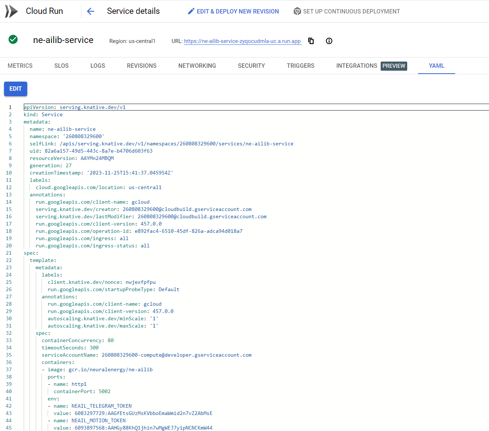
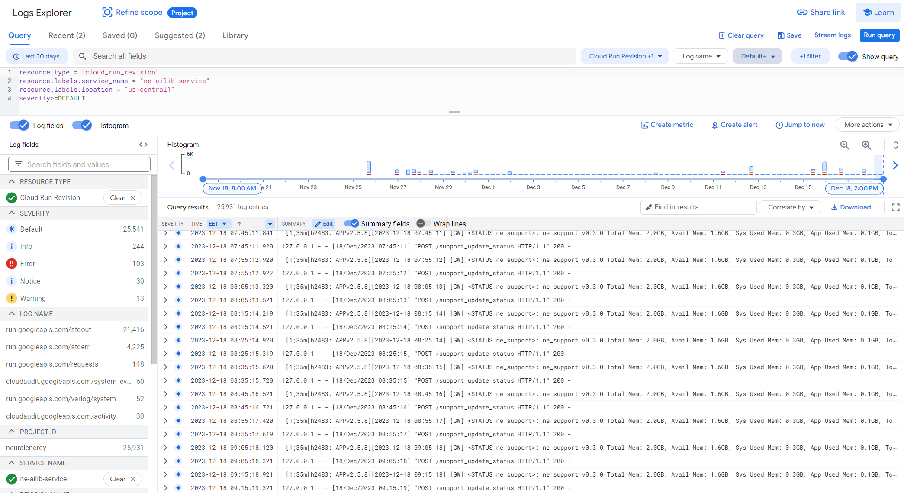
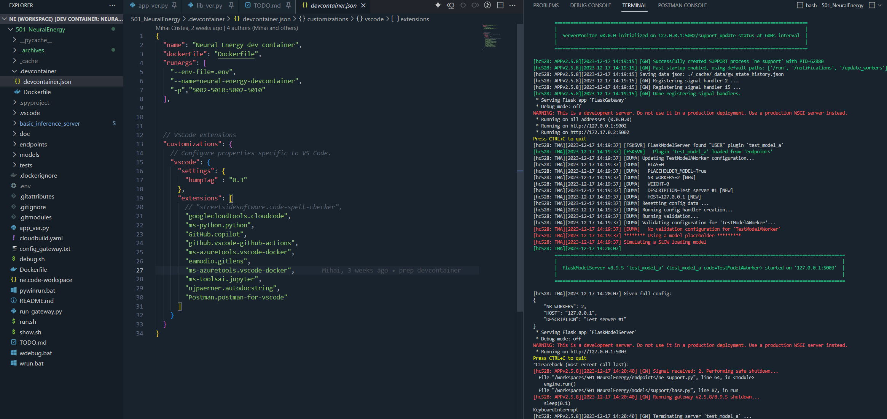

# Introducere

Acest document de testare prezinta raportul final testarii pentru proiectul "Mobile Neural Powerplant" in cadrul activitatii specifice de testare. Documentul se bazeaza pe livrabilele electronice ale contractului de prestari servicii incheiat intre SC Neural Energy SRL si furnizorul extern DIGITIZE TECH SRL. 
Raportul prezent se va concentra pe testarea tehnica si functionala a componentelor software, totodata pezentand succint rezultatele obtinute in urma testarii echipamentelor si a unitatii mobile in vederea atingerii urmatoarelor obiective contractuale:
 - Testarea modulului de energie regenerabila
 - Testarea parametrilor de functionarea a unitatii mobile
 - Testarea bibliotecii NeuralEnergy AI Library
 - Alte elemente de testare cerute de echipa interna de CD:
   - Testarea serverului gateway in Google Cloud Platform prin intermediul unui endpoint de test si a unui script de testare
   - Testarea serverului gateway in mediul local prin intermediul unui endpoint de test si a unui script de testare

# Consideratii 

Intreaga testare pleaca de la premiza ca toate componentele sistemului sunt functionale si au fost testate in prealabil la nivel de dezvoltare. Testarea se concentreaza pe testarea integrata a sistemului in ansamblu si pe testarea de integrare a componentelor sistemului. Ipoteza de testare se bazeaza pe respectarea arhitecturii de tip microservicii si pe respectarea principiilor de dezvoltare a sistemelor distribuite.

Pentru elementele specifice testarii software au fost utilizate atat componente online din Google Cloud Platform.

## Google Cloud Platform

Testarea in Google Cloud Platform a fost realizata prin intermediul unui endpoint de test si a unui script de testare. Endpoint-ul de test a fost configurat in Google Cloud Platform si a fost configurat pentru a rula in regim de testare. Scriptul de testare a fost configurat pentru a rula in regim de testare si simulare a clusterului unitatii mobile in Google Cloud Platform. Pentru aceasta, echipa interna de CD a construit trigger-ul de build si Google Cloud Platform Cloud-Run-ul aferent acestuia in baza unui fisier de configurare `cloudbuild.yaml` care a fost inclus in repository-ul de cod sursa al proiectului.

<center> 
<br>
<br>
<i>Mediul de rulare in regim de testare specific proiectului Neural Energy din Google Cloud Platform</i>
<br><br>
</center>

Echipa de testare a lansat din mediu extern Google Cloud Platform scriptul de testare care a facut request-uri la endpoint-ul de test din Google Cloud Platform in regim de burst. Scriptul de testare a fost rulat in mediul de testare local bazat pe Visual Studio Code si devcontainer. Log-urile au fost culese din Google Cloud Platform si au fost analizate in vederea obtinerii rezultatelor de testare.

<center> 
<br>
<br>
<i>Culegerea, procesare si arhivarea logurilor produse de aplicatie in procesul de testare din mediul Google Cloud Platform</i>
<br><br>
</center>

Pentru testele locale au fost create si rulate instante locale ale microserviciilor folosind mediul de testare local bazat pe Visual Studio Code si devcontainer. Scriptul de testare a fost rulat prin conectarea de aceasta data la gateway-ul local. Log-urile au fost culese din mediul de testare local bazat pe Visual Studio Code si devcontainer si au fost analizate in vederea documentarii rezultatelor de testare.

<center> 
<br>
<br>
<i>Mediul de testare local bazat pe Visual Studio Code si devcontainer</i>
<br><br>
</center>


# Abordare testari de unitate in Python

1. **Cereri în Serie**: În metoda `test_burst_requests`, se folosește o buclă pentru a trimite mai multe cereri către endpoint. Puteți ajusta numărul de iterații conform cerințelor dvs.

2. **Colectarea Semnăturilor Unice**: Scriptul folosește un set (`self.unique_signatures`) pentru a stoca valorile unice ale câmpului "signature" din fiecare răspuns. Setul asigură că sunt păstrate doar valorile unice.

3. **Afișarea Rezultatelor**: Metoda `tearDown` este suprascrisă pentru a afișa semnăturile unice după finalizarea tuturor testelor. Această metodă este apelată automat după fiecare metodă de test din clasă.

4. **Solicitarea Endpoint-ului**: Trimiterea cererilor în serie poate pune o încărcătură semnificativă pe endpoint. Asigurați-vă că endpoint-ul dvs. poate gestiona acest lucru fără probleme, în special dacă testați într-un mediu de producție.

5. **Mediul de Testare**: Preferați întotdeauna testarea într-un mediu de dezvoltare sau staging pentru a evita impactul asupra utilizatorilor reali sau a datelor.


# Rezultate de test 1 (unittest)

Aceasta rulare a fost generata cu script-ul de test `tests/test2.py` care a fost rulat in dev-container si a facut request-uri la endpoint-ul de test din Google Cloud Platform in regim de burst.

```bash
root@3d212eb79e72:/workspaces/501_NeuralEnergy# python tests/test2.py
test_burst_requests (__main__.TestGCPModelEndpoint)
Test the GCP model endpoint with burst requests. ... 
Unique Signatures Collected:
{
    "h25a5.test_model_b.TestModelBWorker.0": 6,
    "h25a5.test_model_b.TestModelBWorker.1": 4
}

Unique dummy predicts outputs collected:
{
    "5001*1 + 2 = 5003 PREDICTED": 1,
    "2709*1 + 2 = 2711 PREDICTED": 1,
    "8843*1 + 2 = 8845 PREDICTED": 1,
    "9000*1 + 2 = 9002 PREDICTED": 1,
    "5817*1 + 2 = 5819 PREDICTED": 1,
    "1049*1 + 2 = 1051 PREDICTED": 1,
    "5789*1 + 2 = 5791 PREDICTED": 1,
    "2656*1 + 2 = 2658 PREDICTED": 1,
    "4828*1 + 2 = 4830 PREDICTED": 1,
    "8927*1 + 2 = 8929 PREDICTED": 1
}
ok

----------------------------------------------------------------------
Ran 1 test in 2.678s

OK
```

# Rezultate unit-testing #2

Aceasta rulare a fost generata cu script-ul de test `tests/test2.py` care a fost rulat in dev-container si a facut request-uri la endpoint-ul de test din Google Cloud Platform in regim de burst.

```bash
root@3d212eb79e72:/workspaces/501_NeuralEnergy# python tests/test2.py
test_burst_requests (__main__.TestGCPModelEndpoint)
Test the GCP model endpoint with burst requests. ... 
Unique Signatures Collected:
{
    "h25a5.test_model_b.TestModelBWorker.1": 7,
    "h25a5.test_model_b.TestModelBWorker.0": 3
}

Unique dummy predicts outputs collected:
{
    "5987*1 + 2 = 5989 PREDICTED": 1,
    "181*1 + 2 = 183 PREDICTED": 1,
    "4131*1 + 2 = 4133 PREDICTED": 1,
    "8591*1 + 2 = 8593 PREDICTED": 1,
    "135*1 + 2 = 137 PREDICTED": 1,
    "590*1 + 2 = 592 PREDICTED": 1,
    "8860*1 + 2 = 8862 PREDICTED": 1,
    "5801*1 + 2 = 5803 PREDICTED": 1,
    "8312*1 + 2 = 8314 PREDICTED": 1,
    "5243*1 + 2 = 5245 PREDICTED": 1
}
ok

----------------------------------------------------------------------
Ran 1 test in 2.694s

OK
```


# Apel model 1

Aceasta rulare a fost generata cu ajutorul Postman si a fost facuta la endpoint-ul de test din Google Cloud Platform.

```json
{
    "call_id": 22,
    "gw-uptime": "0:09:25",
    "hostname": "unknown",
    "predict_result": {
        "description": "Neural Energy inference test endpoint #2",
        "dummy_model_predict": "100*1 + 2 = 102 PREDICTED"
    },
    "signature": "h25a5.test_model_b.TestModelBWorker.1",
    "time": "2023-12-15 23:59:45",
    "ver-app": "2.5.4",
    "ver-lib": "8.9.4",
    "worker_id": "h25a5:1"
}
```

# Apel model 2

Aceasta rulare a fost generata cu ajutorul Postman si a fost facuta la endpoint-ul de test din Google Cloud Platform.

```json
{
    "call_id": 1,
    "gw-uptime": "0:02:53",
    "hostname": "unknown",
    "predict_result": {
        "description": "Neural Energy inference test endpoint #2",
        "dummy_model_predict": "100.0*10 + 5 = 1005.0 PREDICTED"
    },
    "signature": "h9c2c.test_model_b.TestModelBWorker.0",
    "time": "2023-12-16 00:04:56",
    "ver-app": "2.5.5",
    "ver-lib": "8.9.4",
    "worker_id": "h9c2c:0"
}
```

# Rulare locala

In vederea analizarii functionarii locale cu mediul devcontainer a fost rulat script-ul cu `python run_gateway.py` in consola locala.

```bash
[hc528: APPv2.5.8][2023-12-17 14:19:00] Library [hc528: APPv2.5.8 v8.9.5] initialized on machine [3d212eb79e72][ Intel(R) Xeon(R) W-2133 CPU @ 3.60GHz].
[hc528: APPv2.5.8][2023-12-17 14:19:00]   Logger v8.9.5.
[hc528: APPv2.5.8][2023-12-17 14:19:00]   Python v3.10.13 (main, Sep 11 2023, 13:44:35) [GCC 11.2.0].
[hc528: APPv2.5.8][2023-12-17 14:19:00]   Logger DEBUG is enabled at Logger level 
[hc528: APPv2.5.8][2023-12-17 14:19:00]   App debug mode is enabled
[hc528: APPv2.5.8][2023-12-17 14:19:00]   Avail/Total RAM: 10.7 GB / 15.6 GB
[hc528: APPv2.5.8][2023-12-17 14:19:00] Running in normal mode (NO debug enabled)
[hc528: APPv2.5.8][2023-12-17 14:19:00] Running BaseAidApp v2.5.8 on:
  HostID: `hc528` (hostname: 3d212eb79e72)
  Path:   '/workspaces/501_NeuralEnergy'
  TZ:     Europe/Bucharest
  Py:     3.10.13
  OS:     Linux-5.15.133.1-microsoft-standard-WSL2-x86_64-with-glibc2.31
  Docker: True
[hc528: APPv2.5.8][2023-12-17 14:19:00] Show packages: Yes
[hc528: APPv2.5.8][2023-12-17 14:19:00] Packages: 
accelerate                0.24.1
aiohttp                   3.9.0
aiosignal                 1.3.1
annotated-types           0.6.0

. . .

tomli                     2.0.1
toolz                     0.12.0
torch                     2.1.1
torchaudio                2.1.1
torchelastic              0.2.2
torchvision               0.16.1
tornado                   6.3.3
tqdm                      4.65.0
traitlets                 5.7.1
transformers              4.35.0
triton                    2.1.0
truststore                0.8.0
types-dataclasses         0.6.6
typing-extensions         4.7.1
typing-inspect            0.9.0
typing-utils              0.1.0
tzdata                    2023.3
unidecode                 1.2.0
urllib3                   1.26.18
uvicorn                   0.24.0
wcwidth                   0.2.5
webencodings              0.5.1
websocket-client          0.58.0
websockets                12.0
werkzeug                  2.2.2
wheel                     0.41.2
widgetsnbextension        4.0.5
xxhash                    3.4.1
yarl                      1.9.2
yt-dlp                    2023.11.16
zipp                      3.17.0
zstandard                 0.19.0
[hc528: APPv2.5.8][2023-12-17 14:19:04] [GW] NEAIL_TELEGRAM_TOKEN: 608****************************************MsE
[hc528: APPv2.5.8][2023-12-17 14:19:04] [GW] AID_APP_ENV: v1.2
[hc528: APPv2.5.8][2023-12-17 14:19:04] [GW] AID_APP_SHOW_PACKS: Yes
[hc528: APPv2.5.8][2023-12-17 14:19:04] [GW] AID_APP_DOCKER: Yes
[hc528: APPv2.5.8][2023-12-17 14:19:04] [GW] NEAIL_GPT_KEY: sk-*********************************************W3F
[hc528: APPv2.5.8][2023-12-17 14:19:04] [GW] NEAIL_MOTION_TOKEN: 609****************************************W44
[hc528: APPv2.5.8][2023-12-17 14:19:04] [GW] AID_APP_ID: BaseAidApp
[hc528: APPv2.5.8][2023-12-17 14:19:04] [GW] NEAIL_HF_TOKEN: hf_*******************************tZE
[hc528: APPv2.5.8][2023-12-17 14:19:04] [GW] NEAIL_VERSION: 1.0.2
[hc528: APPv2.5.8][2023-12-17 14:19:04] [GW] AID_APP_DEBUG: Yes
[hc528: APPv2.5.8][2023-12-17 14:19:04] [GW] AID_APP_FORCE_CPU: No
[hc528: APPv2.5.8][2023-12-17 14:19:04] [GW] Loading gateway state history from: ./_cache/_data/gw_state_history.json
[hc528: APPv2.5.8][2023-12-17 14:19:04] Loading json 'gw_state_history.json' from 'data'
[hc528: APPv2.5.8][2023-12-17 14:19:04] [GW] Loaded gateway state history:
{
  "CURRENT_STARTUP": "2023-12-15 23:54:15",
  "LAST_RUNTIME_HOURS": "0:01:23",
  "LAST_SHUTDOWN": "2023-12-15 23:55:38",
  "PREVIOUS_STARTUP": "2023-12-15 23:30:24"
}
[hc528: APPv2.5.8][2023-12-17 14:19:04] 
                                          ===================================================
                                          |                                                 |
                                          |  FlaskGateway v8.9.5 started on '0.0.0.0:5002'  |
                                          |                                                 |
                                          ===================================================

[hc528: APPv2.5.8][2023-12-17 14:19:04] [GW] Registering /start_server on `_view_func_start_server`
[hc528: APPv2.5.8][2023-12-17 14:19:04] [GW] Registering /kill_server on `_view_func_kill_server`
[hc528: APPv2.5.8][2023-12-17 14:19:04] [GW] Registering /list_servers on `_view_list_servers`
[hc528: APPv2.5.8][2023-12-17 14:19:04] [GW] Registering /system_status on `_view_system_status`
[hc528: APPv2.5.8][2023-12-17 14:19:04] [GW] Registering /support_update_status on `_view_support_status`
[hc528: APPv2.5.8][2023-12-17 14:19:04] [GW] Registering /shutdown on `_view_shutdown`
[hc528: APPv2.5.8][2023-12-17 14:19:04] [GW]   Starting microservice server 'test_model_a' ...
[hc528: APPv2.5.8][2023-12-17 14:19:04] [GW] Attempting to start server with "SIGNATURE" : "test_model_a"
[hc528: APPv2.5.8][2023-12-17 14:19:04] [GW]   Description: "Test server #1"
[hc528: APPv2.5.8][2023-12-17 14:19:04] [GW] Creating server `test_model_a <test_model_a>` at 127.0.0.1:5003/run
[hc528: APPv2.5.8][2023-12-17 14:19:04] [GW] Running ['python', 'basic_inference_server/basic_inference_server/model_server/run_server.py', '--base_folder', '.', '--app_folder', '_cache', '--config_endpoint', '{"NR_WORKERS": 2, "HOST": "127.0.0.1", "DESCRIPTION": "Test server #1"}', '--host', '127.0.0.1', '--port', '5003', '--execution_path', '/run', '--workers_location', 'endpoints', '--worker_name', 'test_model_a', '--worker_suffix', 'Worker', '--microservice_name', 'test_model_a', '--nr_workers', '2', '--host_id', 'hc528', '--use_tf']
[hc528: APPv2.5.8][2023-12-17 14:19:04] [GW] Waiting for process to 62783 warmup...
run_server cwd: /workspaces/501_NeuralEnergy
BASE: ./_cache
[hc528: TMA][2023-12-17 14:19:06] ./_cache/_logs/hc528: TMA.txt log changed to ./_cache/_logs/20231217_141906_TMA_001_log.txt...
[hc528: TMA][2023-12-17 14:19:06] Library [hc528: TMA v8.9.5] initialized on machine [3d212eb79e72][ Intel(R) Xeon(R) W-2133 CPU @ 3.60GHz].
[hc528: TMA][2023-12-17 14:19:06]   Logger v8.9.5.
[hc528: TMA][2023-12-17 14:19:06]   Python v3.10.13 (main, Sep 11 2023, 13:44:35) [GCC 11.2.0].
[hc528: TMA][2023-12-17 14:19:06]   Logger DEBUG is enabled at Logger level 
[hc528: TMA][2023-12-17 14:19:06]   App debug mode is enabled
[hc528: TMA][2023-12-17 14:19:06]   Avail/Total RAM: 10.7 GB / 15.6 GB
[hc528: APPv2.5.8][2023-12-17 14:19:06] [GW] Successfully created server 'test_model_a' with PID=62783
[hc528: APPv2.5.8][2023-12-17 14:19:06] [GW]   Starting microservice server 'test_model_a-bis' ...
[hc528: APPv2.5.8][2023-12-17 14:19:06] [GW] Attempting to start server with "SIGNATURE" : "test_model_a-bis"
[hc528: APPv2.5.8][2023-12-17 14:19:06] [GW]   Description: "test_model_a server #2. Redundancy server for test_model_a"
[hc528: APPv2.5.8][2023-12-17 14:19:06] [GW] WARNING: Skipping server 'test_model_a-bis' due to its DISABLED status:
 {
    "SERVER_CLASS": "test_model_a",
    "NR_WORKERS": 2,
    "HOST": "127.0.0.1",
    "DISABLED": true,
    "DESCRIPTION": "test_model_a server #2. Redundancy server for test_model_a"
}
[hc528: APPv2.5.8][2023-12-17 14:19:06] [GW]   Starting microservice server 'test_model_b' ...
[hc528: APPv2.5.8][2023-12-17 14:19:07] [GW] Attempting to start server with "SIGNATURE" : "test_model_b"
[hc528: APPv2.5.8][2023-12-17 14:19:07] [GW]   Description: "test_model_b server #1"
[hc528: APPv2.5.8][2023-12-17 14:19:07] [GW] Creating server `test_model_b <test_model_b>` at 127.0.0.1:5004/run
[hc528: APPv2.5.8][2023-12-17 14:19:07] [GW] Running ['python', 'basic_inference_server/basic_inference_server/model_server/run_server.py', '--base_folder', '.', '--app_folder', '_cache', '--config_endpoint', '{"NR_WORKERS": 2, "HOST": "127.0.0.1", "DESCRIPTION": "test_model_b server #1"}', '--host', '127.0.0.1', '--port', '5004', '--execution_path', '/run', '--workers_location', 'endpoints', '--worker_name', 'test_model_b', '--worker_suffix', 'Worker', '--microservice_name', 'test_model_b', '--nr_workers', '2', '--host_id', 'hc528', '--use_tf']
[hc528: APPv2.5.8][2023-12-17 14:19:07] [GW] Waiting for process to 62818 warmup...
[hc528: TMA][2023-12-17 14:19:07] [FSKSVR] Creating 2 workers for server 'test_model_a'
[hc528: TMA][2023-12-17 14:19:07] [FSKSVR] FlaskModelServer found "USER" plugin 'test_model_a'
[hc528: TMA][2023-12-17 14:19:07] [FSKSVR]   Plugin 'test_model_a' loaded from 'endpoints'
[hc528: TMA][2023-12-17 14:19:07] [DUMA] Updating TestModelAWorker configuration...
[hc528: TMA][2023-12-17 14:19:07] [DUMA]   BIAS=0
[hc528: TMA][2023-12-17 14:19:07] [DUMA]   PLACEHOLDER_MODEL=True
[hc528: TMA][2023-12-17 14:19:07] [DUMA]   NR_WORKERS=2 [NEW]
[hc528: TMA][2023-12-17 14:19:07] [DUMA]   WEIGHT=0
[hc528: TMA][2023-12-17 14:19:07] [DUMA]   DESCRIPTION=Test server #1 [NEW]
[hc528: TMA][2023-12-17 14:19:07] [DUMA]   HOST=127.0.0.1 [NEW]
[hc528: TMA][2023-12-17 14:19:07] [DUMA] Resetting config_data ...
[hc528: TMA][2023-12-17 14:19:07] [DUMA] Running config handler creation...
[hc528: TMA][2023-12-17 14:19:07] [DUMA] Created 'TestModelAWorker' config_data handlers: ['cfg_weight', 'cfg_bias', 'cfg_placeholder_model', 'cfg_nr_workers', 'cfg_description', 'cfg_host']
[hc528: TMA][2023-12-17 14:19:07] [DUMA] Running validation...
[hc528: TMA][2023-12-17 14:19:07] [DUMA] Validating configuration for 'TestModelAWorker'...
[hc528: TMA][2023-12-17 14:19:07] [DUMA]   No validation configuration for 'TestModelAWorker'
[hc528: TMA][2023-12-17 14:19:07] ******** Using a model placeholder *********
[hc528: TMA][2023-12-17 14:19:07] Simulating a SLOW loading model
run_server cwd: /workspaces/501_NeuralEnergy
BASE: ./_cache
[hc528: TMB][2023-12-17 14:19:08] ./_cache/_logs/hc528: TMB.txt log changed to ./_cache/_logs/20231217_141908_TMB_001_log.txt...
[hc528: TMB][2023-12-17 14:19:08] Library [hc528: TMB v8.9.5] initialized on machine [3d212eb79e72][ Intel(R) Xeon(R) W-2133 CPU @ 3.60GHz].
[hc528: TMB][2023-12-17 14:19:08]   Logger v8.9.5.
[hc528: TMB][2023-12-17 14:19:08]   Python v3.10.13 (main, Sep 11 2023, 13:44:35) [GCC 11.2.0].
[hc528: TMB][2023-12-17 14:19:08]   Logger DEBUG is enabled at Logger level 
[hc528: TMB][2023-12-17 14:19:08]   App debug mode is enabled
[hc528: TMB][2023-12-17 14:19:08]   Avail/Total RAM: 10.6 GB / 15.6 GB
[hc528: APPv2.5.8][2023-12-17 14:19:09] [GW] Successfully created server 'test_model_b' with PID=62818
[hc528: APPv2.5.8][2023-12-17 14:19:09] [GW]   Starting microservice server 'test_model_b-bis' ...
[hc528: APPv2.5.8][2023-12-17 14:19:09] [GW] Attempting to start server with "SIGNATURE" : "test_model_b-bis"
[hc528: APPv2.5.8][2023-12-17 14:19:09] [GW]   Description: "test_model_b server #2. Redundancy server for test_model_b"
[hc528: APPv2.5.8][2023-12-17 14:19:09] [GW] WARNING: Skipping server 'test_model_b-bis' due to its DISABLED status:
 {
    "SERVER_CLASS": "test_model_b",
    "NR_WORKERS": 2,
    "HOST": "127.0.0.1",
    "DISABLED": true,
    "DESCRIPTION": "test_model_b server #2. Redundancy server for test_model_b"
}
[hc528: APPv2.5.8][2023-12-17 14:19:09] [GW] Fast startup enabled, using default paths: ['/run', '/notifications', '/update_workers']
[hc528: TMB][2023-12-17 14:19:09] [FSKSVR] Creating 2 workers for server 'test_model_b'
[hc528: TMB][2023-12-17 14:19:09] [FSKSVR] FlaskModelServer found "USER" plugin 'test_model_b'
[hc528: APPv2.5.8][2023-12-17 14:19:09] [GW] Registering /run on `partial_view_func_run`
[hc528: APPv2.5.8][2023-12-17 14:19:09] [GW] Registering /notifications on `partial_view_func_notifications`
[hc528: APPv2.5.8][2023-12-17 14:19:09] [GW] Registering /update_workers on `partial_view_func_update_workers`
[hc528: APPv2.5.8][2023-12-17 14:19:09] [GW] Starting gateway server after all endpoints have been defined...
[hc528: TMB][2023-12-17 14:19:09] [FSKSVR]   Plugin 'test_model_b' loaded from 'endpoints'
[hc528: TMB][2023-12-17 14:19:09] [DUMB] Updating TestModelBWorker configuration...
[hc528: APPv2.5.8][2023-12-17 14:19:09] [GW] Information for server 'NeuralEnergy':
[hc528: TMB][2023-12-17 14:19:09] [DUMB]   NR_WORKERS=2 [NEW]
[hc528: TMB][2023-12-17 14:19:09] [DUMB]   DESCRIPTION=test_model_b server #1 [NEW]
[hc528: APPv2.5.8][2023-12-17 14:19:09] [GW]   Total server memory:     15.6 GB
[hc528: TMB][2023-12-17 14:19:09] [DUMB]   HOST=127.0.0.1 [NEW]
[hc528: APPv2.5.8][2023-12-17 14:19:09] [GW]   Total server avail mem:  10.6 GB
[hc528: TMB][2023-12-17 14:19:09] [DUMB]   BIAS=2
[hc528: APPv2.5.8][2023-12-17 14:19:09] [GW]   Total allocated mem:      0.4 GB
[hc528: TMB][2023-12-17 14:19:09] [DUMB]   WEIGHT=1
[hc528: APPv2.5.8][2023-12-17 14:19:09] [GW]   System allocated mem:     4.7 GB
[hc528: TMB][2023-12-17 14:19:09] [DUMB] Resetting config_data ...
[hc528: APPv2.5.8][2023-12-17 14:19:09] [GW]   Disk free:   151.5 GB
[hc528: TMB][2023-12-17 14:19:09] [DUMB] Running config handler creation...
[hc528: APPv2.5.8][2023-12-17 14:19:09] [GW]   Disk total:  250.9 GB
[hc528: TMB][2023-12-17 14:19:09] [DUMB] Created 'TestModelBWorker' config_data handlers: ['cfg_weight', 'cfg_bias', 'cfg_nr_workers', 'cfg_description', 'cfg_host']
[hc528: APPv2.5.8][2023-12-17 14:19:09] [GW] Starting support processes...
[hc528: TMB][2023-12-17 14:19:09] [DUMB] Running validation...
[hc528: APPv2.5.8][2023-12-17 14:19:09] [GW]   Starting support server 'nee' ...
[hc528: TMB][2023-12-17 14:19:09] [DUMB] Validating configuration for 'TestModelBWorker'...
[hc528: APPv2.5.8][2023-12-17 14:19:09] [GW] Attempting to start server with "SIGNATURE" : "nee"
[hc528: TMB][2023-12-17 14:19:09] [DUMB]   No validation configuration for 'TestModelBWorker'
[hc528: APPv2.5.8][2023-12-17 14:19:09] [GW]   Description: "None"
[hc528: TMB][2023-12-17 14:19:09] [FSKSVR] FlaskModelServer found "USER" plugin 'test_model_b'
[hc528: TMB][2023-12-17 14:19:09] [FSKSVR]   Plugin 'test_model_b' loaded from 'endpoints'
[hc528: APPv2.5.8][2023-12-17 14:19:09] [GW] *********************************************
[hc528: TMB][2023-12-17 14:19:09] [DUMB] Updating TestModelBWorker configuration...
[hc528: APPv2.5.8][2023-12-17 14:19:09] [GW]   Creating SUPPORT process endpoints/nee.py  
[hc528: TMB][2023-12-17 14:19:09] [DUMB]   NR_WORKERS=2 [NEW]
[hc528: APPv2.5.8][2023-12-17 14:19:09] [GW] *********************************************
[hc528: TMB][2023-12-17 14:19:09] [DUMB]   DESCRIPTION=test_model_b server #1 [NEW]
[hc528: APPv2.5.8][2023-12-17 14:19:09] [GW] Waiting for process to 62840 warmup...
[hc528: TMB][2023-12-17 14:19:09] [DUMB]   HOST=127.0.0.1 [NEW]
[hc528: TMB][2023-12-17 14:19:09] [DUMB]   BIAS=2
[hc528: TMB][2023-12-17 14:19:09] [DUMB]   WEIGHT=1
[hc528: TMB][2023-12-17 14:19:09] [DUMB] Resetting config_data ...
[hc528: TMB][2023-12-17 14:19:09] [DUMB] Running config handler creation...
/workspaces/501_NeuralEnergy/endpoints/nee.py running from: /workspaces/501_NeuralEnergy
[hc528: TMB][2023-12-17 14:19:09] [DUMB] Running validation...
[hc528: TMB][2023-12-17 14:19:09] [DUMB] Validating configuration for 'TestModelBWorker'...
[hc528: TMB][2023-12-17 14:19:09] [DUMB]   No validation configuration for 'TestModelBWorker'
[hc528: TMB][2023-12-17 14:19:09] 
        =============================================================================================================
        |                                                                                                           |
        |  FlaskModelServer v8.9.5 'test_model_b' <test_model_b code=TestModelBWorker> started on '127.0.0.1:5004'  |
        |                                                                                                           |
        =============================================================================================================

[hc528: TMB][2023-12-17 14:19:09] Given full config:
{
    "NR_WORKERS": 2,
    "HOST": "127.0.0.1",
    "DESCRIPTION": "test_model_b server #1"
}
 * Serving Flask app 'FlaskModelServer'
 * Debug mode: off
WARNING: This is a development server. Do not use it in a production deployment. Use a production WSGI server instead.
 * Running on http://127.0.0.1:5004
Press CTRL+C to quit
BASE: ./_cache
[hc528: NEE][2023-12-17 14:19:11] ./_cache/_logs/hc528: NEE.txt log changed to ./_cache/_logs/20231217_141911_NEE_001_log.txt...
[hc528: NEE][2023-12-17 14:19:11] Library [hc528: NEE v8.9.5] initialized on machine [3d212eb79e72][ Intel(R) Xeon(R) W-2133 CPU @ 3.60GHz].
[hc528: NEE][2023-12-17 14:19:11]   Logger v8.9.5.
[hc528: NEE][2023-12-17 14:19:11]   Python v3.10.13 (main, Sep 11 2023, 13:44:35) [GCC 11.2.0].
[hc528: NEE][2023-12-17 14:19:11]   Logger DEBUG is enabled at Logger level 
[hc528: NEE][2023-12-17 14:19:11]   App debug mode is enabled
[hc528: NEE][2023-12-17 14:19:11]   Avail/Total RAM: 10.6 GB / 15.6 GB
[hc528: NEE][2023-12-17 14:19:11] 
                                    =====================================================
                                    |                                                   |
                                    |  App is running in debug mode - chatbot disabled  |
                                    |                                                   |
                                    =====================================================

[hc528: APPv2.5.8][2023-12-17 14:19:11] [GW] **************** Process failed for ['python', 'endpoints/nee.py', '--config_endpoint', '{"DISABLED": false, "HOST": "NO_HOST", "SERVER": "127.0.0.1", "SERVER_PORT": 5002, "SERVER_PATH": "/support_update_status", "SUPPORT_NAME": "nee"}', '--host_id', 'hc528']:NO_HOST:None *******************
[hc528: APPv2.5.8][2023-12-17 14:19:11] [GW]   Starting support server 'motion' ...
[hc528: APPv2.5.8][2023-12-17 14:19:11] [GW] Attempting to start server with "SIGNATURE" : "motion"
[hc528: APPv2.5.8][2023-12-17 14:19:11] [GW]   Description: "None"
[hc528: APPv2.5.8][2023-12-17 14:19:11] [GW] ************************************************
[hc528: APPv2.5.8][2023-12-17 14:19:11] [GW]   Creating SUPPORT process endpoints/motion.py  
[hc528: APPv2.5.8][2023-12-17 14:19:11] [GW] ************************************************
[hc528: APPv2.5.8][2023-12-17 14:19:11] [GW] Waiting for process to 62862 warmup...
/workspaces/501_NeuralEnergy/endpoints/motion.py running from: /workspaces/501_NeuralEnergy
BASE: ./_cache
[hc528: MO][2023-12-17 14:19:13] ./_cache/_logs/hc528: MO.txt log changed to ./_cache/_logs/20231217_141913_MO_001_log.txt...
[hc528: MO][2023-12-17 14:19:13] Library [hc528: MO v8.9.5] initialized on machine [3d212eb79e72][ Intel(R) Xeon(R) W-2133 CPU @ 3.60GHz].
[hc528: MO][2023-12-17 14:19:13]   Logger v8.9.5.
[hc528: MO][2023-12-17 14:19:13]   Python v3.10.13 (main, Sep 11 2023, 13:44:35) [GCC 11.2.0].
[hc528: MO][2023-12-17 14:19:13]   Logger DEBUG is enabled at Logger level 
[hc528: MO][2023-12-17 14:19:13]   App debug mode is enabled
[hc528: MO][2023-12-17 14:19:13]   Avail/Total RAM: 10.6 GB / 15.6 GB
[hc528: MO][2023-12-17 14:19:13] 
                                   =====================================================
                                   |                                                   |
                                   |  App is running in debug mode - chatbot disabled  |
                                   |                                                   |
                                   =====================================================

[hc528: APPv2.5.8][2023-12-17 14:19:13] [GW] **************** Process failed for ['python', 'endpoints/motion.py', '--config_endpoint', '{"DISABLED": false, "HOST": "NO_HOST", "SERVER": "127.0.0.1", "SERVER_PORT": 5002, "SERVER_PATH": "/support_update_status", "SUPPORT_NAME": "motion"}', '--host_id', 'hc528']:NO_HOST:None *******************
[hc528: APPv2.5.8][2023-12-17 14:19:13] [GW]   Starting support server 'ne_support' ...
[hc528: APPv2.5.8][2023-12-17 14:19:13] [GW] Attempting to start server with "SIGNATURE" : "ne_support"
[hc528: APPv2.5.8][2023-12-17 14:19:13] [GW]   Description: "Neural Energy base cluster support process."
[hc528: APPv2.5.8][2023-12-17 14:19:13] [GW] ****************************************************
[hc528: APPv2.5.8][2023-12-17 14:19:13] [GW]   Creating SUPPORT process endpoints/ne_support.py  
[hc528: APPv2.5.8][2023-12-17 14:19:13] [GW] ****************************************************
[hc528: APPv2.5.8][2023-12-17 14:19:13] [GW] Waiting for process to 62880 warmup...
/workspaces/501_NeuralEnergy/endpoints/ne_support.py running from: /workspaces/501_NeuralEnergy
Using --config_endpoint: {"HOST": "NO_HOST", "PING_INTERVAL": 600, "DESCRIPTION": "Neural Energy base cluster support process.", "SERVER": "127.0.0.1", "SERVER_PORT": 5002, "SERVER_PATH": "/support_update_status", "SUPPORT_NAME": "ne_support"}
BASE: ./_cache
[hc528: SPRC][2023-12-17 14:19:14] ./_cache/_logs/hc528: SPRC.txt log changed to ./_cache/_logs/20231217_141914_SPRC_001_log.txt...
[hc528: SPRC][2023-12-17 14:19:14] Library [hc528: SPRC v8.9.5] initialized on machine [3d212eb79e72][ Intel(R) Xeon(R) W-2133 CPU @ 3.60GHz].
[hc528: SPRC][2023-12-17 14:19:14]   Logger v8.9.5.
[hc528: SPRC][2023-12-17 14:19:14]   Python v3.10.13 (main, Sep 11 2023, 13:44:35) [GCC 11.2.0].
[hc528: SPRC][2023-12-17 14:19:14]   Logger DEBUG is enabled at Logger level 
[hc528: SPRC][2023-12-17 14:19:14]   App debug mode is enabled
[hc528: SPRC][2023-12-17 14:19:14]   Avail/Total RAM: 10.6 GB / 15.6 GB
[hc528: SPRC][2023-12-17 14:19:14] Using config_data: 
{
  "BASE_FOLDER": ".",
  "APP_FOLDER": "_cache",
  "HOST": "NO_HOST",
  "PING_INTERVAL": 600,
  "DESCRIPTION": "Neural Energy base cluster support process.",
  "SERVER": "127.0.0.1",
  "SERVER_PORT": 5002,
  "SERVER_PATH": "/support_update_status",
  "SUPPORT_NAME": "ne_support"
}
[hc528: SPRC][2023-12-17 14:19:15] 
        ===============================================================================================
        |                                                                                             |
        |  ServerMonitor v0.0.0 initialized on 127.0.0.1:5002/support_update_status at 600s interval  |
        |                                                                                             |
        ===============================================================================================

[hc528: APPv2.5.8][2023-12-17 14:19:15] [GW] Successfully created SUPPORT process 'ne_support' with PID=62880
[hc528: APPv2.5.8][2023-12-17 14:19:15] [GW] Fast startup enabled, using default paths: ['/run', '/notifications', '/update_workers']
[hc528: APPv2.5.8][2023-12-17 14:19:15] Saving data json: ./_cache/_data/gw_state_history.json
[hc528: APPv2.5.8][2023-12-17 14:19:15] [GW] Registering signal handler 2 ...
[hc528: APPv2.5.8][2023-12-17 14:19:15] [GW] Registering signal handler 15 ...
[hc528: APPv2.5.8][2023-12-17 14:19:15] [GW] Done registering signal handlers.
 * Serving Flask app 'FlaskGateway'
 * Debug mode: off
WARNING: This is a development server. Do not use it in a production deployment. Use a production WSGI server instead.
 * Running on all addresses (0.0.0.0)
 * Running on http://127.0.0.1:5002
 * Running on http://172.17.0.2:5002
Press CTRL+C to quit
[hc528: TMA][2023-12-17 14:19:37] [FSKSVR] FlaskModelServer found "USER" plugin 'test_model_a'
[hc528: TMA][2023-12-17 14:19:37] [FSKSVR]   Plugin 'test_model_a' loaded from 'endpoints'
[hc528: TMA][2023-12-17 14:19:37] [DUMA] Updating TestModelAWorker configuration...
[hc528: TMA][2023-12-17 14:19:37] [DUMA]   BIAS=0
[hc528: TMA][2023-12-17 14:19:37] [DUMA]   PLACEHOLDER_MODEL=True
[hc528: TMA][2023-12-17 14:19:37] [DUMA]   NR_WORKERS=2 [NEW]
[hc528: TMA][2023-12-17 14:19:37] [DUMA]   WEIGHT=0
[hc528: TMA][2023-12-17 14:19:37] [DUMA]   DESCRIPTION=Test server #1 [NEW]
[hc528: TMA][2023-12-17 14:19:37] [DUMA]   HOST=127.0.0.1 [NEW]
[hc528: TMA][2023-12-17 14:19:37] [DUMA] Resetting config_data ...
[hc528: TMA][2023-12-17 14:19:37] [DUMA] Running config handler creation...
[hc528: TMA][2023-12-17 14:19:37] [DUMA] Running validation...
[hc528: TMA][2023-12-17 14:19:37] [DUMA] Validating configuration for 'TestModelAWorker'...
[hc528: TMA][2023-12-17 14:19:37] [DUMA]   No validation configuration for 'TestModelAWorker'
[hc528: TMA][2023-12-17 14:19:37] ******** Using a model placeholder *********
[hc528: TMA][2023-12-17 14:19:37] Simulating a SLOW loading model
[hc528: TMA][2023-12-17 14:20:07] 
        =============================================================================================================
        |                                                                                                           |
        |  FlaskModelServer v8.9.5 'test_model_a' <test_model_a code=TestModelAWorker> started on '127.0.0.1:5003'  |
        |                                                                                                           |
        =============================================================================================================

[hc528: TMA][2023-12-17 14:20:07] Given full config:
{
    "NR_WORKERS": 2,
    "HOST": "127.0.0.1",
    "DESCRIPTION": "Test server #1"
}
 * Serving Flask app 'FlaskModelServer'
 * Debug mode: off
WARNING: This is a development server. Do not use it in a production deployment. Use a production WSGI server instead.
 * Running on http://127.0.0.1:5003
Press CTRL+C to quit
^CTraceback (most recent call last):
[hc528: APPv2.5.8][2023-12-17 14:20:40] [GW] Signal received: 2. Performing safe shutdown...
  File "/workspaces/501_NeuralEnergy/endpoints/ne_support.py", line 64, in <module>
    engine.run()
  File "/workspaces/501_NeuralEnergy/models/support/base.py", line 87, in run
[hc528: APPv2.5.8][2023-12-17 14:20:40] [GW] Running gateway v2.5.8/8.9.5 shutdown...
    sleep(0.1)
KeyboardInterrupt
[hc528: APPv2.5.8][2023-12-17 14:20:40] [GW] Terminating server 'test_model_a' ...
[hc528: APPv2.5.8][2023-12-17 14:20:40] [GW]   'test_model_a' terminated with code: -15
[hc528: APPv2.5.8][2023-12-17 14:20:42] [GW]   Server 'test_model_a' deallocated.
[hc528: APPv2.5.8][2023-12-17 14:20:42] [GW] Terminating server 'test_model_b' ...
[hc528: APPv2.5.8][2023-12-17 14:20:42] [GW]   'test_model_b' terminated with code: 0
[hc528: APPv2.5.8][2023-12-17 14:20:44] [GW]   Server 'test_model_b' deallocated.
[hc528: APPv2.5.8][2023-12-17 14:20:44] [GW] Terminating server 'ne_support' ...
[hc528: APPv2.5.8][2023-12-17 14:20:44] [GW]   'ne_support' terminated with code: -2
[hc528: APPv2.5.8][2023-12-17 14:20:46] [GW]   Server 'ne_support' deallocated.
[hc528: APPv2.5.8][2023-12-17 14:20:46] Saving data json: ./_cache/_data/gw_state_history.json
[hc528: APPv2.5.8][2023-12-17 14:20:46] [GW] Terminating gateway server v2.5.8/8.9.5 with pid 62725 with signal 9...
Killed
```

In figura-log de mai sus este prezentata o rulare a aplicatiei in modul debug. In aceasta situatie, aplicatia nu este functionala, deoarece nu exista un server de chatbot care sa raspunda la intrebari. In mod normal, serverul de chatbot este un server separat, care poate fi rulat in paralel cu serverul de inferenta. In acest caz, serverul de chatbot este dezactivat, iar aplicatia nu este functionala. Cazul acesta este folosit pentru a demonstra functionarea exclusiv a modulelor de tip web-API in modul debug.

> Nota: Datorita lungimii mari a listei de pachete disponibile aceasta a fost redusa din figura/log de mai sus. Pentru a vedea lista completa de pachete disponibile, se poate rula comanda `pip list` in containerul de dezvoltare. Lista de pachete este afisata si serializata in log-uri pentru a putea fi verificata in cazul in care este nevoie si apar probleme de incompatibilitate intre versiuni.

# Concluzii 

In acest document am prezentat modul de functionare al aplicatiei NeuralEnergy, precum si modul de instalare si rulare. Aplicatia este functionala si poate fi folosita pentru a demonstra modul de functionare al unui sistem de inferenta bazat pe retele neuronale. Aplicatia este dezvoltata in Python, folosind framework-ul Flask pentru a crea servere de tip web-API. Aplicatia este dezvoltata in mod modular, astfel incat fiecare server de inferenta poate fi dezvoltat separat, iar aplicatia poate fi configurata pentru a rula unul sau mai multe servere de inferenta in paralel. In urma testarii efectuate a fost confirmata ipoteza ca aplicatia este functionala si poate fi folosita pentru a operationaliza un sistem de inferenta bazat pe retele neuronale precum si alte sisteme de tip web-API ce necesita orchestrare si scalare fara a fi necesare cunostinte avansate de programare sau eforturi de dezvoltare a infrastructurii (DevOps) suplimentare.

Testarea aferenta componentelor unitatii mobile a confirmat potentialul de scalare si replicare a acesteia pentru utilizarea in aplicatii unde procesarea in-situ este necesara. In urma testarii a fost confirmata ipoteza ca unitatea mobila este functionala si poate fi folosita pentru a operationaliza modululele sofware ale Neural Energy AiLibrary.